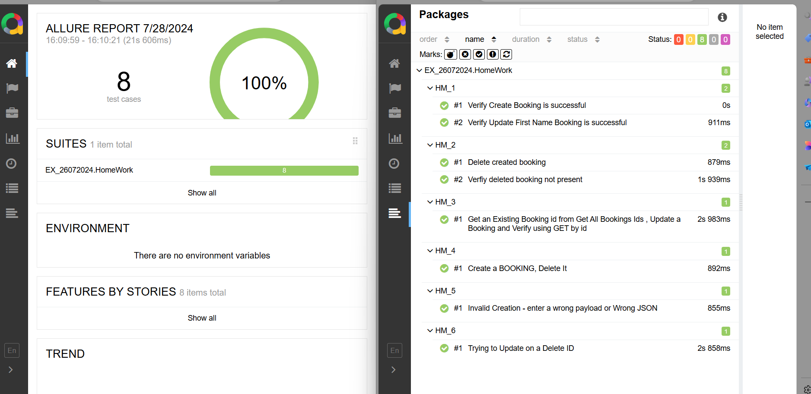

To download pytest and install allure report
pip install pytest
pip install allure-pytest

download node.js from https://nodejs.org/en
verify download and installed 
node -v

npm install -g npm allure-commandline

pytest EX_26072024/HomeWork/HM_1.py --alluredir=allure-results
allure generate --clean
allure serve .\allure-results\

